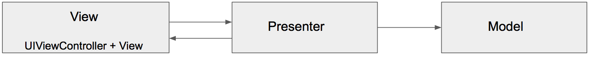
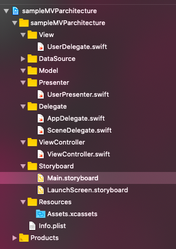

# Sample MVP Architecture

    

**MVP** is an architectural pattern, a derivation of the Model–View–Controller. It's represented by three distinct components: Model, View and the Presenter. It was engineered to facilitate automated unit testing and improve the separation of concerns in presentation logic.

- **Model** is an interface responsible for the domain data (to be displayed or otherwise acted upon in the GUI)
- **View** is responsible for the presentation layer (GUI)
- **Presenter** is the "middle-man" between Model and View. It reacts to the user’s actions performed on the View, retrieves data from the Model, and formats it for display in the View.

## My MVP project structure

## [UserDelegate.swift](https://github.com/JosafatCMtz/sample-MVP-architecture/blob/master/sampleMVParchitecture/View/UserDelegate.swift).

Defining the model of methods that adapt to a particular functionality task.

    protocol UserDelegate: NSObjectProtocol {
        func showProgress()
        func hideProgress()
        func signinDidSucceed()
        func signinDidFailed(message: String)
    }

## [UserPresenter.swift](https://github.com/JosafatCMtz/sample-MVP-architecture/blob/master/sampleMVParchitecture/Presenter/UserPresenter.swift).

Retrieves data from the Model, and formats it for display in the View.

        class UserPresenter {
            weak var delegate: UserDelegate?

            init(delegate: UserDelegate) {
                self.delegate = delegate
            }

            func register(username: String, password: String) {
                self.delegate?.showProgress()
                if username.isEmpty {
                    print("email can't be blank")
                    self.delegate?.signinDidFailed(message: "email can't be blank")
                }
                let delay = DispatchTime.now() + Double(Int64(Double(NSEC_PER_SEC)*2)) / Double(NSEC_PER_SEC)

                DispatchQueue.main.asyncAfter(deadline: delay) {
                    self.delegate?.hideProgress()
                    self.delegate?.signinDidSucceed()
                }
            }
        }

## [ViewController.swift](https://github.com/JosafatCMtz/sample-MVP-architecture/blob/master/sampleMVParchitecture/ViewController/ViewController.swift)

A container view controller embeds the content of other view controllers into its root view.

    class ViewController: UIViewController {
        // MARK: - IBOutlets

        @IBOutlet var usernameTextFild: UITextField!
        @IBOutlet var passwordTextField: UITextField!
        @IBOutlet weak var spinner: UIActivityIndicatorView!
        @IBOutlet weak var signinButton: UIButton!

        // MARK: - Properties

        var userPresenter: UserPresenter!

        // MARK: - viewDidLoad

        override func viewDidLoad() {
            super.viewDidLoad()
            // Do any additional setup after loading the view.
            self.userPresenter = UserPresenter(delegate: self)
            guard let spinner = self.spinner else { return }
            spinner.hidesWhenStopped = true
        }

        // MARK: - IBActions
        @IBAction func buttonSignInDidTap() {
            guard let presenter = userPresenter else { return }
            guard let username = usernameTextFild.text else { return }
            guard let password = passwordTextField.text else { return }
            presenter.register(username: username, password: password)
        }
    }
    extension ViewController: UserDelegate {
        func signinDidSucceed() {
            signinButton.setTitle("Success", for: .normal)
            signinButton.setTitleColor(.green, for: .normal)
            usernameTextFild.text = ""
            passwordTextField.text = ""
        }

        func signinDidFailed(message: String) {
            usernameTextFild.placeholder = message
        }

        func showProgress() {
            guard let spinner = self.spinner else { return }
            spinner.startAnimating()
        }

        func hideProgress() {
            guard let spinner = self.spinner else { return }
            spinner.stopAnimating()
        }

    }

# Security Policy

## Supported Versions

Use this section to tell people about which versions of your project are
currently being supported with security updates.

| Version | Supported          |
| ------- | ------------------ |
| 5.1.x   | :white_check_mark: |
| 5.0.x   | :x:                |
| 4.0.x   | :white_check_mark: |
| < 4.0   | :x:                |

## Reporting a Vulnerability

Use this section to tell people how to report a vulnerability.

Tell them where to go, how often they can expect to get an update on a
reported vulnerability, what to expect if the vulnerability is accepted or
declined, etc.
